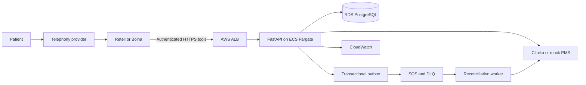

# Architecture

## Ownership

- Cliniko owns the live practice business, practitioners, branch-prefixed appointment types, synthetic patients, availability, and final appointment records. The application maps those types to the Jayanagar and Indiranagar physical branches.
- PostgreSQL owns call state, reservations, conflict enforcement, idempotency, audit, recovery, and evaluation state.
- The mock PMS implements the Cliniko gateway contract for clean-clone tests and failure injection.

## Runtime

Availability is fetched fresh from the PMS and overlaid with unexpired local reservations. A booking is confirmed only after PostgreSQL accepts the reservation and Cliniko returns a definitive appointment record.
