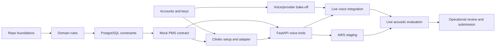

# Production-Grade Implementation Plan

Project: 2care Clinic Voice Agent

Plan status: proposed for approval

Prepared: 2026-07-18

Primary owner: one engineer, with the user providing account access, budget decisions, and approval for commits, pushes, and deployments

Related documents:

- [Architecture](architecture.md)
- [Original assignment](assignment/original-assignment.docx)
- [Extracted assignment text](assignment/assignment.txt)
- [Research and decision register](research-and-decision-register.md)
- [Implementation specification](implementation-spec.md)
- [Clinic and PMS decision](decisions/0001-clinic-and-pms.md)
- [Production AWS decision](decisions/0002-production-aws.md)
- `../data/clinic_source_manifest.json`

## 1. Objective

Deliver an independently callable, production-oriented clinic voice receptionist that:

- uses one assignment-compliant managed voice platform: Retell or Bolna;
- supports English, Hindi, and natural mid-sentence Hinglish;
- represents two publicly sourced Physiotattva branches in a Cliniko trial;
- uses synthetic schedules, patients, and appointment history;
- completes booking, rescheduling, cancellation, and conflict recovery;
- recognizes returning callers, shared family phones, missed callbacks, and dropped calls;
- rechecks live availability instead of trusting conversational memory;
- prevents overlapping bookings at PostgreSQL write time;
- handles uncertain PMS outcomes without falsely confirming an appointment;
- deploys on production-grade AWS infrastructure;
- includes reproducible tests, evaluation evidence, observability, security controls, runbooks, and deployment automation.

The system is complete only when reviewers can call it, exercise the required scenarios, inspect the repository, and reproduce the non-acoustic tests from a clean clone.

## 2. Scope

### 2.1 P0 submission-critical scope

- One Cliniko business with two application branches, two practitioners, four branch-prefixed appointment types, synthetic availability, and synthetic patients.
- One live inbound phone number.
- English, Hindi, and Hinglish conversations.
- Booking, rescheduling, cancellation, and write-time conflict handling.
- Required identity, callback, stale availability, earliest-slot, branch triage, dropped-call, fee, timezone, interruption, bot-disclosure, and follow-up scenarios.
- FastAPI backend and PostgreSQL.
- Cliniko gateway and contract-compatible mock PMS.
- AWS staging deployment that is continuously warm and independently callable.
- Terraform definitions for staging and production profiles.
- Multi-turn eval harness with committed per-language results.
- README, prompt, architecture, deployment guide, limitations, and live number.

### 2.2 P1 production-readiness scope

- Two ECS tasks across availability zones.
- Multi-AZ RDS, highly available egress, point-in-time recovery, alarms, and tested restore procedure.
- Automated Cliniko reconciliation worker and DLQ operations.
- Load, soak, fault-injection, security, and disaster-recovery tests.
- Automated deployment promotion and rollback.
- Data retention and recording governance.

### 2.3 Explicit non-goals

- Clinical diagnosis, triage advice, emergency advice beyond directing callers to appropriate emergency services, prescriptions, or treatment recommendations.
- Real Physiotattva patient information or real operational availability.
- A clinic staff dashboard or marketing website.
- More than two branches or two practitioners for the initial submission.
- A custom speech pipeline when Retell or Bolna already supplies orchestration.
- Premature multi-region deployment.

## 3. Delivery principles

1. **Test first.** Every behavioral change begins with a focused failing test.
2. **Backend owns truth.** The LLM collects intent; deterministic backend code owns dates, policies, identity, availability ranking, and mutation correctness.
3. **No false confirmation.** Unknown PMS state is `pending_verification`, never `confirmed`.
4. **Fresh reads before writes.** Availability is queried again when constraints change and immediately before mutation.
5. **One source per responsibility.** Cliniko owns live PMS records; PostgreSQL owns local correctness, state, and recovery.
6. **Provider isolation.** Domain and application code cannot depend directly on Bolna, Retell, Cliniko, or AWS SDK types.
7. **Evidence over claims.** Latency, multilingual quality, and reliability claims require committed measurements and sample counts.
8. **Synthetic healthcare data only.** Public clinic facts are sourced; operational and patient data are synthetic.
9. **Infrastructure is code.** No undocumented production console setup.
10. **Production and staging are named honestly.** A single-task deployment is not called highly available.

## 4. Assumptions and external dependencies

### 4.1 Assumptions

- Development is performed by one engineer.
- Python 3.11 is the local baseline; AWS container runtime will use a pinned compatible version.
- AWS region is `ap-south-1` unless voice-platform latency measurements justify another region.
- Clinic timezone is `Asia/Kolkata`; currency is INR.
- Cliniko trial permits one practice business with the required practitioner and appointment-type setup.
- The assignment review window is known before production resources are shut down.

### 4.2 Access dependencies

| Dependency | Needed for | Blocking phase | Owner |
|---|---|---|---|
| Cliniko trial and API key | Live clinic setup and contract validation | Phase 5 | User |
| Bolna account/credits | Platform bake-off and live agent | Phase 1/8 | User |
| Retell account/credits | Platform bake-off | Phase 1 | User |
| Telephony number/KYC | Independently callable agent | Phase 8 | User |
| LLM/ASR/TTS keys or platform credits | Provider benchmark | Phase 1 | User |
| AWS account and deployment role | Infrastructure deployment | Phase 10 | User |
| GitHub repository/account | Remote collaboration and CI | Phase 2 | User |
| Domain name, if desired | Friendly endpoint | Phase 10, non-blocking | User |

No key is committed, pasted into documentation, or stored in Terraform state.

## 5. Decision gates

### Gate A: clinic and data

Status: passed.

- Physiotattva Jayanagar and Indiranagar approved.
- Four publicly listed practitioners approved.
- Public facts versus synthetic operations explicitly separated.

### Gate B: voice platform and providers

Status: pending credentials.

Candidates:

- Platform: Bolna baseline, Retell challenger.
- ASR: Soniox multilingual baseline; Sarvam and Gladia challengers.
- LLM: fast mini-class baseline; larger model only when smaller model fails correctness gates.
- TTS: ElevenLabs and Sarvam baseline comparison; Azure/Cartesia fallback.
- Telephony: Twilio preferred when a number is quickly available; Plivo or platform-hosted number fallback.

The selected combination must pass the benchmark in Phase 1. The decision record includes exact model versions, configuration, dataset, results, and reversal trigger.

### Gate C: infrastructure sizing and budget

Status: architecture approved; budget pending.

- Staging: one ECS task, single-AZ RDS, one NAT gateway.
- Production: two or more ECS tasks, Multi-AZ RDS, NAT per availability zone.
- The live review environment must be declared as staging or production.

### Gate D: repository and implementation

Status: local repository approved and initialized. No staging, commit, push, deployment, or billable resource creation without user confirmation.

## 6. Target service-level objectives

These are engineering targets, not claims until measured.

| Objective | Staging acceptance | Production target |
|---|---:|---:|
| Core scenario correctness | 100% | 100% |
| Overall scripted scenario completion | >= 90% per language | >= 95% per language |
| Booking-critical entity accuracy | >= 90% per language | >= 95% per language |
| Tool selection and argument correctness | >= 98% | >= 99.5% |
| Fresh availability after changed constraint | 100% | 100% |
| Double-booking prevention | Exactly one winner in every race | Exactly one winner |
| Pure-language drift | <= 2% of agent turns | <= 1% |
| Interruption recovery | >= 90% | >= 95% |
| Voice end-to-end latency | p50 <= 1.2 s; p95 <= 2.0 s | Same after load |
| Backend read-tool latency | p95 <= 500 ms excluding PMS | p95 <= 400 ms excluding PMS |
| Backend mutation latency | p95 <= 1.5 s excluding explicit pending state | p95 <= 1.2 s |
| API availability | Smoke-test period only | 99.9% monthly |
| Recovery point objective | Daily backup acceptable for staging | <= 5 minutes |
| Recovery time objective | <= 2 hours | <= 30 minutes |
| Oldest reconciliation message | <= 5 minutes | <= 60 seconds normally |

## 7. Environment strategy

| Environment | Purpose | PMS | Voice | Database | AWS profile |
|---|---|---|---|---|---|
| Unit | Pure domain behavior | None | None | None | None |
| Integration | Transactions and adapters | Mock | None | Ephemeral PostgreSQL | Local/CI |
| Local | Developer API and manual tests | Mock by default | Optional web test | Docker PostgreSQL | None |
| Sandbox | Cliniko contract validation | Cliniko trial | Optional | Isolated PostgreSQL | Local or staging |
| Staging | Full end-to-end and reviewer validation | Cliniko trial | Live agent/number | RDS single-AZ | One ECS task |
| Production | HA reference deployment | Approved PMS account | Live agent/number | Multi-AZ RDS | Two+ ECS tasks |

Environment configuration is validated at startup. Production refuses mock PMS, default secrets, debug logging, or unencrypted database connections.

## 8. Critical path



Provider-neutral backend work proceeds while credentials are being gathered. The final prompt/config and acoustic suite cannot complete without Gate B.

## 9. Phase 0: program setup and requirement lock

Status: substantially complete.

### Objectives

- Establish authoritative requirements and architecture.
- Prevent ambiguity from leaking into implementation.
- Create the local repository and engineering conventions.

### Tasks

- Preserve the assignment text and trace every requirement to a planned proof.
- Record clinic/PMS and AWS ADRs.
- Record public clinic provenance.
- Define P0/P1 scope and non-goals.
- Create `AGENTS.md`, `.gitignore`, `pyproject.toml`, `README`, and local `venv` workflow.
- Configure Ruff and Pytest.
- Create GitHub labels/milestones after remote repository access exists.

### Exit criteria

- Repository runs tests from a clean local environment.
- No unresolved clinic or source-of-truth ambiguity.
- User has approved clinic, repository name, and AWS direction.

## 10. Phase 1: voice and provider bake-off

Priority: P0. Can run in parallel with Phases 2-4 once credentials exist.

### Objectives

- Select Retell or Bolna using measured clinic-specific evidence.
- Freeze exact ASR, LLM, TTS, telephony, endpointing, and interruption settings.

### Preparation

- Implement a temporary authenticated echo/function endpoint against no patient data.
- Create identical prompt intent and function schemas for both platforms.
- Prepare 30 calls: 10 English, 10 Hindi, 10 Hinglish.
- Use at least five speakers, clean/noisy conditions, and two network conditions.
- Include dates, times, INR, branch names, practitioner names, interruptions, and a tool conflict.

### Measurements

- Critical-entity exact match by language and entity type.
- Word error rate and Hindi character error rate.
- Code-switch boundary errors.
- Correct tool, valid JSON, and exact argument match.
- State retained after interruption.
- Pure-language drift.
- ASR, LLM, tool/network, TTS, and end-to-end p50/p95/p99.
- Cost per completed conversation, not merely cost per minute.
- Call setup failures, dropped audio, webhook failures, and trace completeness.

### Tests

- Re-run each deterministic tool opportunity at least five times.
- Include timeout, 409 conflict, 429, and malformed-result fixtures.
- Manually review every failed and a random sample of passed transcripts.
- Ensure automatic semantic scores do not hide human-observed failures.

### Deliverables

- `docs/decisions/0003-voice-platform.md`.
- `evals/reports/platform-bakeoff.json`.
- Redacted call manifest with provider call IDs.
- Final versioned platform configuration and model versions.

### Exit criteria

- One assignment-compliant platform passes every core gate.
- Selected ASR/TTS passes Hindi and Hinglish entity/pronunciation gates.
- Final choice and limitations are defensible with measurements.

## 11. Phase 2: repository, CI, and development platform

Priority: P0.

### Objectives

- Make every change reproducible, reviewable, and automatically verified.

### Tasks

- Add typed application dependencies with exact compatible ranges.
- Add FastAPI, Pydantic, SQLAlchemy async, Alembic, asyncpg, HTTPX, structlog, OpenTelemetry, and AWS clients only when tests require them.
- Add MyPy or Pyright in strict-enough incremental mode.
- Add pre-commit configuration for Ruff, formatting, secret scanning, and basic file checks.
- Add Dockerfile with pinned digest/base version, non-root user, read-only root filesystem compatibility, and health check.
- Add Docker Compose for local PostgreSQL and mock PMS dependencies.
- Add Makefile or `scripts/dev` commands only where they reduce repeated commands.

### GitHub Actions pull-request lane

- Install from lock file.
- Run Ruff format/check.
- Run static typing.
- Run unit tests and coverage.
- Start PostgreSQL and run integration/contract/concurrency tests.
- Build the container.
- Run dependency, secret, and container scans.
- Run Terraform format/validate/lint once infrastructure exists.
- Upload test and coverage reports without secrets.

### Main-branch lane

- Repeat all PR checks.
- Build immutable image tagged by commit SHA.
- Push to ECR only after deployment access and user approval.
- Deploy automatically to staging only after explicit workflow approval.
- Production promotion is manual and approval-gated.

### Exit criteria

- Clean clone has one documented bootstrap path.
- CI fails on tests, lint, typing, secret scan, migration drift, or image build failure.
- No environment-specific generated file is committed.

## 12. Phase 3: domain rules and deterministic language-independent logic

Priority: P0.

### Work packages

#### 3.1 Provenance

- Validate every clinic fact as sourced, derived, or synthetic.
- Require official URL and retrieval date for sourced fields.
- Normalize source display values without losing original spelling.
- Add a source freshness/check script that reports changes but does not silently rewrite data.

#### 3.2 Time resolution

- Parse absolute date/time and year rollover.
- Resolve today/tomorrow, weekdays, “next” ambiguity, and recurring weekday preferences.
- Normalize morning, afternoon, evening, “after work,” and “around” ranges.
- Resolve in `Asia/Kolkata` using injected call time.
- Reject impossible/past windows explicitly.
- Keep deterministic rules language-independent after structured intent extraction.

#### 3.3 Identity

- Normalize E.164 phone numbers.
- Return zero, one, or multiple patient candidates.
- Require full name before mutation.
- Disambiguate shared numbers by name before asking unnecessary fields.
- Avoid revealing full patient data before disambiguation.

#### 3.4 Policies

- Determine fee applicability from appointment time, current clinic time, and configured policy.
- Separate policy disclosure from consent and mutation.
- Apply buffers and appointment duration consistently.
- Return INR and local date/time fields explicitly.

#### 3.5 Operation state machine

- Enforce legal booking/reschedule/cancel transitions.
- Model local conflict, remote conflict, pending verification, compensation, and permanent failure.
- Make terminal operations idempotent.

### Testing

- Table-driven unit tests for every assignment date phrase in EN/HI/Hinglish structured forms.
- Property tests for timezone boundaries, range ordering, and state-machine invariants where useful.
- No database, HTTP, framework, or provider imports in domain tests.
- Domain branch coverage target: >= 90% with all safety branches explicitly tested.

### Exit criteria

- Domain behavior is deterministic and framework-independent.
- No prompt instruction duplicates an untested business rule.

## 13. Phase 4: PostgreSQL persistence and concurrency

Priority: P0.

### Schema work

- Add Alembic baseline and `btree_gist` extension.
- Create clinic mapping, call session, call participant, constraint, outbound context, booking operation, slot reservation, PMS attempt, outbox, follow-up, tool-call, and evaluation tables.
- Use UUIDs or sortable opaque identifiers generated by the application.
- Store timestamps as `timestamptz`; never use naive timestamps.
- Add optimistic `version` columns to mutable workflow records.
- Add uniqueness constraints for idempotency keys and webhook event IDs.
- Add foreign keys, check constraints, status enums/checks, and targeted indexes.
- Add partial GiST exclusion constraint for active reservation ranges.

### Transaction boundaries

- Call bootstrap read transaction.
- Availability audit transaction separate from external PMS calls.
- Reservation transaction commits before remote write.
- Remote outcome transition transaction is idempotent.
- Transactional outbox record is committed with every state requiring asynchronous follow-up.
- Never hold a database transaction open across an external HTTP request.

### Tests

- Migrate from empty database to head and back where reversible.
- Verify schema from a real PostgreSQL container, never SQLite.
- Launch 20 concurrent requests for one slot; assert one reservation and nineteen typed conflicts.
- Test overlapping starts, nested intervals, equal endpoints, buffers, expired holds, different practitioners, and cancelled statuses.
- Test duplicate idempotency keys under concurrency.
- Test worker optimistic-lock races.
- Test transaction rollback leaves no orphan outbox or reservation state.

### Operational tasks

- Add migration runbook and one-off ECS migration task design.
- Add backup/restore compatibility notes for extension and migrations.
- Add query timing and slow-query logging with PII-safe parameters.

### Exit criteria

- Write-time conflict is proved by the database.
- All migrations run in local and CI PostgreSQL.
- No external request occurs inside a database transaction.

## 14. Phase 5: PMS gateway, mock, and Cliniko

Priority: P0.

### 5.1 Gateway contract

Define provider-neutral typed methods:

- `list_businesses`
- `list_practitioners`
- `list_appointment_types`
- `find_patients_by_phone`
- `get_patient_appointments`
- `search_available_times`
- `create_appointment`
- `reschedule_appointment`
- `cancel_appointment`
- `get_appointment`
- `find_conflicts`

Every method defines timeout, retryability, pagination behavior, stable errors, and redaction behavior.

### 5.2 Mock PMS

- Store data durably in PostgreSQL.
- Implement the exact gateway contract.
- Support deterministic fixtures and clock injection.
- Enforce idempotency on mutations.
- Inject latency, timeout-before-write, timeout-after-write, 429, transient 5xx, validation error, and conflict.
- Expose test-only controls unavailable in production mode.
- Restart the mock in integration tests to prove durability.

### 5.3 Cliniko bootstrap

- Add dry-run inventory and account identity verification.
- Verify one business; map two application branches, two existing practitioners, appointment types, availability, and patients by deterministic demo marker.
- Confirm the business, practitioners, and appointment types are enabled for Cliniko Online Bookings; Cliniko returns no availability otherwise.
- Require explicit `--apply`.
- Never delete or mutate unmarked records.
- Archive only records created by the project during cleanup.
- Store generated ID map outside Git.
- Print a redacted verification summary.

### 5.4 Cliniko adapter

- Use Basic authentication exactly as documented.
- Send required application `User-Agent` with contact address.
- Derive API shard safely from configuration/account data.
- Handle pagination and the 200 requests/minute/user limit.
- Respect `X-RateLimit-Reset` with bounded retries and jitter.
- Set connect/read/write/pool timeouts.
- Reconcile timeout-after-write before retrying create.
- Map Cliniko errors to stable gateway errors.
- Validate branch, practitioner, appointment type, and patient relationships.
- Never log authentication or full payload PII.

### Contract tests

- Run one shared suite against the mock.
- Run safe read and isolated mutation cases against the Cliniko trial.
- Mark external Cliniko tests separately so clean-clone CI does not require credentials.
- Record any semantic difference between mock and Cliniko as a contract limitation.

### Exit criteria

- Cliniko contains the approved demo dataset.
- Gateway contract suite passes against the mock and approved Cliniko subset.
- Timeout-after-write does not create duplicate mock appointments and has a documented Cliniko reconciliation path.

## 15. Phase 6: application services and voice tool API

Priority: P0.

### 6.1 Application services

- Call bootstrap and resume eligibility.
- Patient disambiguation.
- Availability fan-out, filtering, ranking, and audit.
- Booking reservation and remote orchestration.
- Reschedule compensation workflow.
- Cancellation and fee disclosure checks.
- Follow-up creation.
- Call checkpoint persistence.

### 6.2 API foundation

- FastAPI app factory and lifespan management.
- Pydantic request/response schemas.
- Stable error envelope and request IDs.
- Readiness and liveness endpoints with different semantics.
- Strict content type, request size, and timeout limits.
- OpenAPI artifact checked for unintended changes.

### 6.3 Tool endpoints

- `POST /v1/tools/bootstrap-call`
- `POST /v1/tools/search-availability`
- `POST /v1/tools/book-appointment`
- `POST /v1/tools/list-patient-appointments`
- `POST /v1/tools/reschedule-appointment`
- `POST /v1/tools/cancel-appointment`
- `POST /v1/tools/save-call-checkpoint`
- `POST /v1/tools/log-follow-up`

### 6.4 Authentication

- HMAC signature with timestamp and replay window when platform custom headers permit it.
- Otherwise rotating bearer token plus strict source/network controls.
- Constant-time signature comparison.
- Event/request ID uniqueness for replay defense.
- Separate webhook and tool credentials.

### 6.5 Availability token

- Opaque signed token or server-side query ID.
- Contains no trusted client-supplied slot truth.
- Expires quickly.
- Binds call, query, branch, practitioner, and appointment type.
- Booking still rechecks Cliniko.

### Tests

- Unit tests for services with real domain objects and gateway fakes only where network boundaries require them.
- HTTP integration tests against PostgreSQL and mock PMS.
- Contract snapshots for all request/response schemas.
- Security tests for missing/invalid/expired signature, replay, malformed JSON, oversized payload, and ID enumeration.
- Test all required assignment scenarios at API level.
- Test that no returned error leaks internal exception, SQL, secret, or unrelated patient data.

### Exit criteria

- Every voice tool has stable, documented behavior.
- Core API scenario suite passes with mock PMS.
- Authentication and replay controls are verified.

## 16. Phase 7: durable call state and recovery

Priority: P0.

### Call-session behavior

- Create session from platform call ID and direction.
- Normalize caller/called numbers.
- Store language mode per turn without treating it as identity.
- Persist only authoritative workflow facts, not an opaque LLM transcript as state.
- Record disconnect reason and last safe checkpoint.

### Returning caller

- Look up all synthetic patients by phone through PMS.
- For one match, use context but still require full name before mutation.
- For multiple matches, request name first and reveal minimal identifying information.
- For no match, collect only required new-patient fields.

### Missed outbound callback

- Store outbound campaign intent before dialing.
- Record no-answer/busy/failed disposition idempotently.
- On inbound call, match eligible recent context by phone and campaign.
- Acknowledge callback and resume the original purpose.

### Dropped-call recovery

- Eligibility window configurable, initially 30 minutes.
- Resume most recent eligible incomplete session for the same caller.
- Acknowledge the drop once.
- Preserve confirmed identity and constraints.
- Requery availability because old results are stale.
- Never repeat a completed mutation.

### Tests

- Disconnect before identity, after identity, after slot offer, during mutation, and after remote success before local acknowledgement.
- Duplicate start/end webhooks.
- Two concurrent calls from one family phone.
- Old sessions outside resume window.
- Multiple incomplete sessions and deterministic selection.
- Callback context consumed exactly once.

### Exit criteria

- Required recovery scenarios pass at API and multi-turn levels.
- Resumption never reuses stale availability or duplicates a booking.

## 17. Phase 8: voice agent integration

Priority: P0 after Gate B.

### Versioned assets

- Exact platform config/export where supported.
- System prompt and language-specific sections.
- Tool schemas generated from or checked against backend models.
- Opening message, holding phrases, timeout messages, handoff/follow-up text, and disclosure behavior.
- Pronunciation configuration for practitioner and branch names.
- Endpointing, interruption, and silence settings.

### Prompt architecture

- Identity and scope.
- Language mirroring and code-switch rules.
- Minimal-turn information collection.
- Full-name mutation gate.
- Tool selection policy.
- Fresh availability policy.
- Confirmation read-back fields.
- Honest pending/failure language.
- Clinical concern and human follow-up behavior.
- Bot-disclosure response.
- No clinical advice and no invented data.

### Conversation efficiency

- Bootstrap from caller number before asking for information already available.
- Ask one compact clarification when several fields are missing only if natural.
- Offer at most three ranked slots.
- Confirm branch, practitioner, local date/time, and applicable fee once.
- Avoid repeating full summaries after every turn.

### Telephony

- Provision/import number and record KYC limitations.
- Bind one production agent version.
- Verify inbound routing, codec, caller ID, and webhook delivery.
- Configure call recording/retention only with documented consent behavior.
- Test no-answer, busy, voicemail, hangup, and reconnect dispositions.

### Tests

- Text playground regression against same prompt/tools.
- Automated multi-turn simulator for deterministic dialogue logic.
- Human acoustic calls for voice quality and interruption.
- Pre-recorded noisy audio for ASR regression.
- Both directions of English/Hindi code switching within a sentence.
- All-caps name pronunciation and INR/date/time speech.
- Tool delay with natural single holding phrase and no stutter.

### Exit criteria

- Live number passes every P0 scenario.
- Prompt and platform config are versioned and reproducible.
- No language bucket depends only on text simulation.

## 18. Phase 9: evaluation harness and quality evidence

Priority: P0.

### Test pyramid

```text
                Live telephony and acoustic E2E
             Multi-turn prompt/tool simulations
          HTTP, PostgreSQL, PMS contract integration
       Domain, policy, state-machine, and parser unit tests
```

### Scenario taxonomy

- `identity`: returning, new, shared phone, full name.
- `time`: absolute, relative, weekday, recurrence, day part, timezone boundary.
- `availability`: stale result, global earliest, branch-specific, specialty.
- `mutation`: booking, race, reschedule, cancellation, fee window, buffer.
- `recovery`: dropped call, missed callback, duplicate webhook, timeout-after-write.
- `language`: English, Hindi, Hinglish both directions, no drift.
- `conversation`: interruption, filler, redundant question, all-caps pronunciation.
- `safety`: bot disclosure, human request, clinical concern, unsupported workflow.

### Required result fields

- Scenario and version.
- Language bucket.
- Environment and timestamp.
- Platform/model/provider versions.
- Pass/fail by deterministic assertion.
- Semantic/human score separately.
- Turns to completion.
- Redundant questions.
- Tool calls and argument correctness.
- ASR entity matches.
- Language drift.
- Component and total latency samples.
- Artifact references and redaction status.

### Coverage targets

| Layer | Target |
|---|---:|
| Domain line coverage | >= 90% |
| Application service line coverage | >= 85% |
| Safety-critical branches | 100% explicit cases |
| PMS gateway methods | 100% contract coverage |
| Voice tool endpoints | 100% success and documented error contracts |
| Assignment required scenarios | 100% represented in multi-turn suite |
| Core scenarios on live phone | 100% pass before submission |

Coverage percentage is a warning signal, not a substitute for scenario quality.

### False-confidence controls

- Do not blend EN and HI metrics.
- Keep Hinglish separate even if the assignment only asks EN/HI reporting.
- Do not call backend latency voice latency.
- Do not count a scripted text pass as ASR/TTS/interruption evidence.
- Review deterministic passes that semantic/human judges fail.
- Include denominator, p95/p99, and failure examples.
- Re-run critical scenarios multiple times to expose nondeterminism.

### Exit criteria

- Harness runs from clean clone without live credentials in mock mode.
- Live report contains real call IDs and redacted evidence.
- README numbers exactly match committed report artifacts.

## 19. Phase 10: AWS infrastructure and deployment

Priority: P0 staging; P1 full HA validation.

### Terraform modules

- `network`: VPC, subnets, routes, NAT, endpoints where economical.
- `security`: security groups, KMS keys, IAM roles/policies.
- `database`: subnet group, parameter group, RDS PostgreSQL, backups.
- `compute`: ECR, ECS cluster, task definition, service, autoscaling.
- `edge`: ALB, target group, listeners, ACM, optional Route 53.
- `messaging`: SQS queue, DLQ, policies, alarms.
- `observability`: log groups, metric filters, dashboards, alarms.
- `secrets`: secret containers/references only, never values in state.

Avoid modules that wrap one resource without reducing complexity.

### Container

- Multi-stage build.
- Pinned Python base image.
- Non-root user.
- Minimal runtime dependencies.
- Read-only filesystem and temporary volume where possible.
- Graceful SIGTERM and connection draining.
- Immutable image by commit SHA.
- Image vulnerability scan and SBOM.

### Database deployment

- Migration runs as one-off ECS task before service promotion.
- Migration role separate from application role.
- Backward-compatible expand/contract changes for zero-downtime releases.
- Backup or snapshot before destructive migration.
- Deployment stops when migration fails.

### Release procedure

1. CI builds and scans immutable image.
2. Terraform plan is reviewed.
3. User approves billable deployment.
4. Apply infrastructure changes.
5. Run migration task.
6. Deploy ECS revision with circuit breaker.
7. Run readiness and external smoke tests.
8. Run one synthetic booking/cancel canary.
9. Promote/retain revision only if alarms remain healthy.

### Rollback

- Roll ECS service back to previous task definition.
- Do not blindly downgrade schema.
- Use forward-fix or documented reversible migration.
- Disable voice-agent routing to unhealthy backend if needed.
- Drain or quarantine failed queue messages; do not discard.
- Reconcile pending PMS operations before reopening booking.

### Exit criteria

- Terraform can recreate staging from documented inputs.
- External smoke test passes from outside AWS.
- Rollback rehearsal succeeds.
- Live number reaches healthy backend and real RDS.

## 20. Phase 11: security and privacy hardening

Priority: P0 baseline, P1 comprehensive review.

### Threat model

Protect against:

- forged voice tool requests;
- webhook replay;
- caller enumeration of other patients;
- prompt injection causing unauthorized tools;
- duplicate booking through retries;
- race conditions and stale availability;
- leaked API keys or Terraform state;
- logs/recordings exposing patient data;
- SSRF or arbitrary outbound URLs;
- SQL injection and mass assignment;
- denial of service and expensive tool loops;
- compromised dependency/container image.

### Controls

- Typed allowlisted tool schemas.
- Backend authorization independent of prompt instructions.
- HMAC/bearer authentication and replay window.
- Rate limiting by platform credential, caller hash, and endpoint class.
- Query parameterization through SQLAlchemy.
- Fixed configured provider base URLs.
- Least-privilege IAM and database roles.
- Secrets Manager rotation procedure.
- PII redaction at logger boundary.
- Encrypted RDS, backups, queues, logs, and transport.
- Short data retention for transcripts/recordings and documented deletion.
- No real patients in any environment.
- Dependabot/Renovate, lockfile review, secret scan, SAST, image scan, and SBOM.

### Verification

- Authentication/replay tests.
- IDOR/patient-isolation tests.
- Injection/malformed-input suite.
- Secret scan of complete Git history before submission.
- Dependency and container vulnerability report.
- Manual review of IAM policies for wildcards.
- Log sampling to prove redaction.

### Exit criteria

- No critical/high unresolved security finding.
- No secret or real patient data in repository or artifacts.
- Security limitations are documented honestly.

## 21. Phase 12: observability and operations

Priority: P0 essential telemetry, P1 SLO operations.

### Structured events

- Call started, bootstrapped, disconnected, resumed, completed.
- Patient candidates found and disambiguated without PII values.
- Availability query started/completed and candidate count.
- Slot offered and selected.
- Reservation created/conflicted/expired.
- PMS request started/succeeded/failed/unknown/reconciled.
- Booking/reschedule/cancel state transition.
- Follow-up created/resolved.
- Webhook accepted/replayed/rejected.

### Correlation

`platform_call_id -> call_session_id -> tool_call_id -> booking_operation_id -> pms_attempt_id`

Every log and trace includes the applicable identifiers, environment, version, and language bucket. Phone numbers are hashed or masked.

### Metrics

- Request rate, error rate, and latency by tool.
- PMS latency/error/rate-limit counters.
- Booking outcomes and conflict counts.
- Pending-verification count and age.
- Queue depth, oldest age, retries, and DLQ count.
- Call completion and recovery rate.
- Language scenario outcomes and drift.
- ECS CPU/memory/restarts/healthy targets.
- RDS CPU, storage, connections, locks, and replication/failover status.

### Alerts

- No healthy ALB targets.
- Elevated 5xx or p95 latency.
- Any DLQ message.
- Pending PMS operation older than threshold.
- RDS storage/connection saturation.
- Repeated Cliniko 401/403/429.
- Synthetic live-number canary failure.

Alerts must link to a runbook and avoid exposing PII.

### Runbooks

- API unavailable.
- Cliniko unavailable/rate-limited.
- Booking stuck in pending verification.
- DLQ processing.
- Database connection saturation.
- Failed deployment/migration.
- Secret rotation.
- Restore from backup.
- Voice number/platform outage.
- Disable booking while preserving informational calls.

### Exit criteria

- A fresh operator can diagnose each alert using repository documentation.
- One injected PMS failure is visible end to end in traces, metrics, queue, and runbook.

## 22. Phase 13: performance, resilience, and disaster recovery

Priority: P1, with basic P0 checks.

### Performance tests

- Baseline one call/tool at a time.
- Concurrent availability reads.
- Concurrent races for same and different practitioners.
- Sustained expected load for 30 minutes.
- Burst to configured ECS autoscaling threshold.
- Measure database pool, PMS rate-limit pressure, and queue behavior.

Do not load-test Cliniko beyond permitted limits; use the mock for high-volume tests.

### Fault injection

- PMS delay, timeout, 429, 500, malformed response, and outage.
- Database transient disconnect and exhausted pool.
- Worker crash after remote success but before local acknowledgement.
- Duplicate/out-of-order webhook events.
- ECS task termination during booking.
- Queue redrive and poison message.

### Disaster recovery

- Restore RDS snapshot/PITR into isolated environment.
- Apply current migrations.
- Verify operation/idempotency state.
- Reconcile pending remote appointments.
- Validate application startup and synthetic canary.
- Record measured RPO/RTO.

### Exit criteria

- No tested failure produces a false confirmation or duplicate mock appointment.
- Recovery procedure is measured, documented, and repeatable.

## 23. Phase 14: release readiness and submission

Priority: P0.

### Functional readiness

- Every assignment scenario mapped to a passing test and evidence artifact.
- Live number independently callable.
- English, Hindi, and Hinglish verified.
- Booking, reschedule, cancel, and conflict reflected in Cliniko.
- Shared phone, dropped call, missed callback, stale availability, and earliest-across-branches pass.
- Human follow-up is honest and persisted.

### Engineering readiness

- Clean clone instructions tested on a fresh environment.
- CI green.
- Database migrations at head.
- No uncommitted generated state required.
- Terraform plan documented.
- Deployment and rollback tested.
- Security scans reviewed.
- Alerts and runbooks reviewed.

### Evidence package

- README with measured stack justification.
- Architecture and decision records.
- Prompt and prompt logic.
- Tool schemas/OpenAPI.
- Clinic source manifest and disclaimer.
- Per-language eval report.
- Latency report with methodology and sample count.
- Redacted live call manifest.
- Known limitations.
- Phone number and availability window.
- Deployment/profile statement.

### Final independent test

1. Clone repository into a clean directory.
2. Follow only README instructions.
3. Run unit/integration/contract/eval suites in mock mode.
4. Call the live number from a phone not used during development.
5. Execute one EN, one HI, and one Hinglish scenario.
6. Confirm backend, PostgreSQL, and Cliniko state.
7. Verify logs are correlated and redacted.
8. Revert synthetic appointments created by final verification.

### Approval gates

- User confirms before staging files.
- User confirms before commit and push.
- User confirms before billable deployment.
- User confirms final phone number, repository visibility, and submission email.

## 24. Three-day critical-path schedule

This schedule is aggressive. It prioritizes complete, truthful P0 behavior; P1 hardening continues only after P0 gates are green.

### Day 1: correctness foundation

Morning:

- Finalize dependencies and CI skeleton.
- Implement domain time, identity, policy, and state-machine tests.
- Implement PostgreSQL migrations and exclusion constraint.

Afternoon/evening:

- Prove concurrency race.
- Define PMS gateway and implement mock contract/failure injection.
- Begin Cliniko bootstrap once credentials arrive.

Day 1 exit:

- Mock-mode booking core is transactionally correct.
- Cliniko demo data is created or access is the only blocker.

### Day 2: integrations and live path

Morning:

- Complete Cliniko adapter contract.
- Implement FastAPI tool endpoints and authentication.
- Implement durable caller/callback/drop state.

Afternoon/evening:

- Complete platform/provider bake-off and freeze Gate B.
- Configure live agent and telephony.
- Deploy AWS staging through Terraform.
- Run initial live EN/HI/Hinglish calls.

Day 2 exit:

- Live number reaches AWS backend and Cliniko.
- Happy path plus core conflicts work in all language modes.

### Day 3: adversarial evaluation and release

Morning:

- Run full multi-turn and acoustic suites.
- Fix only evidence-backed failures test-first.
- Tune endpointing, prompt, TTS pronunciation, and latency.

Afternoon:

- Fault tests for timeout, duplicate, drop, callback, and slot race.
- Validate security, redaction, monitoring, and alarms.
- Produce reports and README.

Evening:

- Clean-clone rehearsal.
- Independent live calls.
- Final requirement trace.
- User review, commit/push/deployment approval, and submission package.

Day 3 exit:

- All P0 gates green or limitations explicitly block submission.

## 25. Backlog priority

### P0: cannot submit without it

- Live bilingual number.
- Cliniko demo setup.
- Full appointment lifecycle.
- Database conflict constraint.
- Required recovery scenarios.
- Mock PMS idempotency/failure behavior.
- Per-language multi-turn eval and component latency.
- AWS live backend/database.
- Clean clone and complete documentation.

### P1: production-grade before external clinic use

- Full HA AWS production profile.
- Restore/failover rehearsal.
- Sustained load/soak and fault injection.
- Formal data retention and consent process.
- Automated canary and on-call routing.
- Security review and dependency-remediation SLA.

### P2: valuable after assignment

- Operations dashboard.
- Additional branches/services.
- SMS confirmations and reminders.
- Staff review workflow for follow-ups.
- Analytics cohorting and A/B tests.
- Multi-region/read-replica strategy when justified by traffic.

## 26. Risk register

| Risk | Probability | Impact | Mitigation | Trigger/contingency |
|---|---|---|---|---|
| Credentials arrive late | Medium | Critical | Continue provider-neutral backend; use mock | Freeze Retell/Bolna only when access exists |
| India phone number/KYC delay | Medium | Critical | Try Twilio, Plivo, then hosted number | Use fastest independently callable compliant number |
| Cliniko trial limitations | Medium | High | Keep the dataset to two practitioners; dry-run inventory | Add practitioners only when a stated scenario needs them |
| Bolna Hindi/tool gate failure | Medium | High | Retell benchmark remains ready | Switch platform based on recorded gate |
| Retell multilingual accuracy loss | Medium | High | Test smallest language set and providers | Prefer Bolna if it passes |
| Timeout after Cliniko write | Medium | Critical | Local operation ledger and reconciliation | Return pending, never retry blind |
| Database race bug | Low after constraint | Critical | GiST constraint and concurrent test | Block release on any duplicate |
| AWS setup consumes deadline | Medium | High | Terraform minimal modules; staging first | Defer P1 HA validation, not live AWS staging |
| NAT/ALB/RDS cost exceeds budget | Medium | Medium | Explicit staging profile and budget alarms | User approves size/window before apply |
| Voice latency too high | Medium | High | Component traces; shorter prompt; faster models | Trade model only after correctness remains green |
| Hindi TTS mispronounces names/dates | Medium | High | Provider comparison and pronunciation fixtures | Use per-language TTS/lexicon |
| Eval passes but voice fails | High without controls | High | Separate text and acoustic evidence | Acoustic core gates block submission |
| Public clinic data changes | Low | Medium | Source manifest and retrieval dates | Update manifest with reviewed diff |
| Accidental PII/secret commit | Low with controls | Critical | Synthetic data, `.gitignore`, scans | Rewrite before any push; rotate exposed key |

## 27. Definition of done

A work item is done only when:

- behavior is specified by a test that was observed failing first;
- implementation is minimal and reviewed against architecture boundaries;
- unit/integration/contract tests pass as applicable;
- lint, formatting, typing, and security checks pass;
- logs and metrics exist for operational behavior;
- error and rollback behavior are documented;
- no secret or PII is introduced;
- documentation and decision records are updated when behavior changes;
- acceptance evidence is linked to the requirement;
- user approval is obtained for any stage/commit/push/deployment action that requires it.

## 28. Immediate next work package

After this plan is approved:

1. Add PostgreSQL, SQLAlchemy, Alembic, and testcontainer dependencies through a failing integration test.
2. Create the baseline migration.
3. Implement `slot_reservations` and its GiST exclusion constraint.
4. Run a 20-way concurrent booking test against real PostgreSQL.
5. Add operation/idempotency/outbox tables required by the booking transaction.
6. Stop for review before beginning the mock PMS gateway.

No files will be staged, committed, pushed, or deployed until the user explicitly confirms that action.
