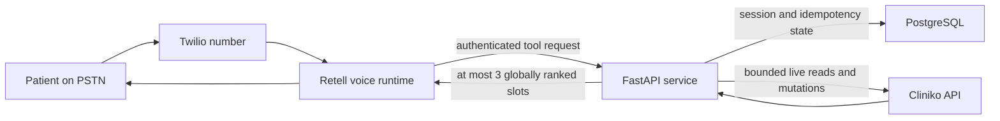

# Production Voice Reliability Decisions

Last reviewed: 2026-07-22

This note records the production choices behind the live Retell and Cliniko path. It
separates controls implemented in code from account-level operations that must be
configured and verified in provider dashboards.

## Request Path

## Decisions

| Concern | Alternatives considered | Decision and reason | Status |
|---|---|---|---|
| Earliest slot across branches | Let the LLM call each branch and compare; backend fan-out and rank | Backend accepts 1-4 targets, fetches them concurrently, deduplicates, globally sorts, and returns at most three. This removes timestamp comparison from the probabilistic layer and reduces two-target latency from a sum to the slowest request. | Implemented and tested |
| Incomplete upstream results | Return slots from successful branches; fail the whole search | Fail the whole search. A partial response cannot truthfully claim to be the earliest across all requested branches. The voice agent must acknowledge the lookup failure and create a follow-up. | Implemented |
| Number of spoken options | Return every slot; return 3; return 1 | Return at most 3. This bounds prompt/tool payload size and caller memory load while preserving a useful choice. The response reports the total and whether it was truncated. | Implemented and tested |
| Cliniko load | Unlimited fan-out; sequential requests; bounded concurrent requests | Limit a request to four targets and 20 practitioner IDs per target, reject invalid fan-out before any upstream call, and deduplicate repeated targets. This supports the two-branch clinic without open-ended request multiplication. | Implemented and tested |
| Read retries | No retry; retry every request; bounded idempotent retry | Cliniko GET/HEAD calls use finite timeouts and at most two retries. Rate limits honor `X-RateLimit-Reset` with a 30-second ceiling. Mutations are not automatically retried because their outcome may be unknown. | Implemented and tested |
| Mutation safety | Raw timestamps; availability capability token | Booking and rescheduling require a short-lived session-bound availability token. Booking, rescheduling, and cancellation use idempotency keys and durable operation state. Unknown booking outcomes enter reconciliation rather than being repeated. | Implemented and tested |
| Tool-call determinism | Free-form calls; strict structured calls | Retell strict tool-call mode is enabled. The tool schema forbids the old single-target shape and describes when to send one versus all targets. | Implemented and live-verified |
| LLM latency | Larger model or premium Fast Tier; shorter prompt and measured tuning | Keep the current deterministic model settings and do not enable Fast Tier without measured need because Retell prices it at 1.5x. Measure per-call ASR, LLM, TTS, network, and custom-function latency before changing model or endpointing. | Baseline implemented; live call measurement required |
| TTS outage | Depend on one provider; Retell fallback | Retell documents automatic fallback for platform/standard voices and configurable fallback for third-party voices. The selected voice must be checked in the dashboard and a cross-provider fallback selected if Retell classifies it as third-party. | Dashboard verification required |
| Monitoring | Logs only; provider and application alerts | Keep structured request/tool latency logs and use Retell alerts for call success, custom-function latency/failures, API errors, and cost. Alert thresholds need real-call baselines rather than invented values. | Application logs implemented; dashboard thresholds require baseline |

## Failure Behavior

- Validation errors fail before Cliniko is called.
- A failed target fails the complete cross-branch search; no partial slot list is spoken.
- No available slots is a valid empty result, not a system error.
- A stale or wrong-session availability token is rejected by the backend.
- A conflict triggers a fresh search; the agent never claims success before Cliniko confirms it.
- A timeout after a mutation is treated as an unknown outcome and reconciled, not retried blindly.
- If live availability cannot be established, the agent states that plainly and logs a human follow-up.

## Operational Checks Before Production

1. Run the English, Hindi, and Hinglish evaluation calls and capture redacted per-call latency breakdowns.
2. Set Retell alerts after the baseline exists: call success, custom-function latency and failures, API errors, and cost.
3. Confirm whether `11labs-Monika` is treated as a third-party voice and configure a similar cross-provider TTS fallback when required.
4. Subscribe the operator to Cliniko and Retell status notifications.
5. Review Cliniko rate-limit and tool-latency percentiles after representative traffic; reduce practitioner/target ceilings if traffic grows.

## Deployment Evidence

- GitHub Actions [staging run 39](https://github.com/khushalkumar/2care-clinic-voice-agent/actions/runs/29916964169) deployed application commit `5145185` successfully on 2026-07-22.
- The post-deployment readiness request returned `200` and the authenticated catalog returned one business, two practitioners, and four branch-specific appointment types.
- A read-only live smoke test bootstrapped a call session and searched two initial-consultation targets in one request. The backend globally ranked 13 Cliniko slots, returned exactly three, marked the response truncated, and issued a session-bound availability token for every returned slot.
- The published Retell LLM requires `session_id`, `targets`, `starts_at`, and `ends_at`; `targets.maxItems` is four and strict tool calls remain enabled.

## Sources

- [Retell: Troubleshoot high latency](https://docs.retellai.com/reliability/troubleshoot-latency) - measure the per-call component breakdown, keep estimated latency below 1.5 seconds, and treat model choice and prompt length as primary levers.
- [Retell: LLM options](https://docs.retellai.com/build/llm-options) - structured output, temperature, retry/timeout behavior, and Fast Tier's 1.5x pricing.
- [Retell: Dynamic variables](https://docs.retellai.com/build/dynamic-variables) - supported use of phone-call system variables in prompts and tools.
- [Retell: TTS fallback](https://docs.retellai.com/build/tts-fallback) - automatic standard-voice fallback and explicit third-party fallback configuration.
- [Retell: Alerting](https://docs.retellai.com/features/alerting-overview) - call success, custom-function latency/failures, API error, and cost alerts.
- [Cliniko API documentation](https://docs.api.cliniko.com/) - 200 requests per minute per user, `X-RateLimit-Reset`, pagination, and chronological availability.
- [AWS: Retry with backoff](https://docs.aws.amazon.com/prescriptive-guidance/latest/cloud-design-patterns/retry-backoff.html) - retry only transient failures and require idempotency.
- [Amazon Builders' Library: Timeouts, retries, and backoff with jitter](https://aws.amazon.com/builders-library/timeouts-retries-and-backoff-with-jitter/) - bounded retries, overload avoidance, and unknown-outcome risk.
