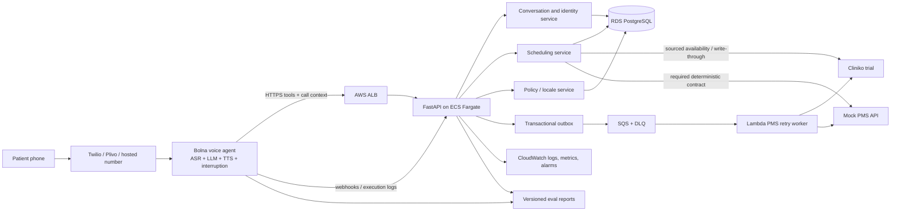
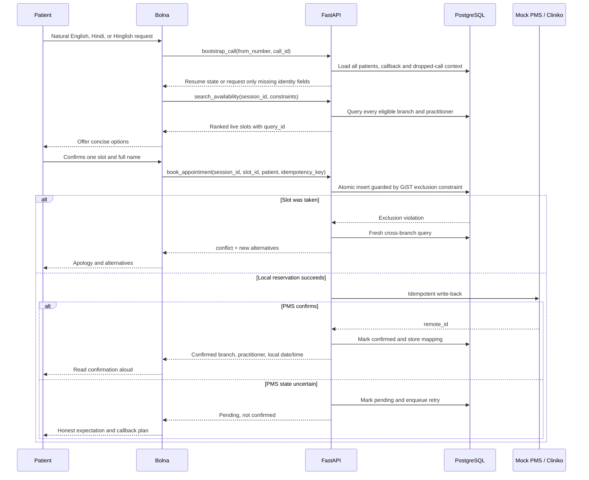

# 2care.ai Voice AI Assignment: Research and Decision Register

Status: planning and evidence collection. No implementation decision is final until the acceptance gates in this document are met.

Last reviewed: 2026-07-18

## 1. Decision method

This project will not choose technology from feature lists alone. Every material choice follows the same sequence:

1. Apply assignment hard gates. A technically attractive option that violates an explicit requirement is rejected.
2. Define measurable criteria before testing.
3. Separate evidence from inference.
4. Score viable alternatives, then test whether changing weights changes the winner.
5. Run a small benchmark for claims that materially affect the build.
6. Record the decision, rejected alternatives, risks, and a reversal trigger.

### Evidence grades

| Grade | Meaning | How it may be used |
|---|---|---|
| A | Reproduced measurement from our deployed system | Can support the final README claim |
| B | Official product documentation or API response | Supports capability, not quality |
| C | Vendor case study, testimonial, demo, or pricing claim | Directional only |
| D | Community review, YouTube review, GitHub submission, or inference | Generates hypotheses; never decides alone |

Vendor claims such as “low latency,” “accurate Hindi,” and “reliable tools” are not measurements. The final README will replace them with our p50/p95 results and test denominators.

### Scoring rules

- Score each criterion from 0 to 5.
- Multiply score by the decision-specific weight.
- Add a confidence grade to prevent a well-marketed but unmeasured product from appearing certain.
- A hard-gate failure overrides the weighted score.
- Recalculate platform and deployment matrices with three profiles: assignment-first, production-first, and cost-first.

## 2. Requirement traceability

| Assignment requirement | Planned proof, not merely implementation |
|---|---|
| Retell or Bolna, one platform live | Public phone number, platform config snapshot/export, call IDs and recordings |
| English, Hindi, mid-sentence switching | Separate EN, HI, and Hinglish acoustic suites; language-drift and entity metrics |
| Real clinic, at least two branches | Source manifest with official URLs, retrieval date, and fact/assumption labels |
| Real doctors, departments, slot structures | Seed provenance plus Cliniko setup screenshots/API export |
| Book, reschedule, cancel, conflicts | Multi-turn tests plus database state assertions |
| Returning caller and shared phone | Tests with one number mapped to two patients; full-name gate |
| Missed outbound callback | Persisted campaign context and an inbound callback test |
| Stale availability | Tool trace proving a fresh search after every changed constraint |
| Earliest across branches/practitioners | Seeded counterexample where the globally earliest slot is not first in storage |
| Dropped-call recovery | Disconnect and redial test with state continuation |
| Real datastore, write-time conflict | PostgreSQL integration test with concurrent booking attempts |
| Mock PMS with idempotency and failure behavior | Replay, timeout-after-write, transient failure, and permanent conflict tests |
| Per-language multi-turn eval | Versioned scenarios and committed machine-readable report |
| Component latency | Platform traces plus backend spans, p50/p95/p99 and sample count |
| Clean clone | CI runs lint, unit, integration, migrations, seed, and offline eval |
| Independently callable | External smoke test from a clean environment and documented health endpoint |

## 3. Clinic selection

### Hard gates

- Two or more independently verifiable physical branches.
- Named practitioners and services from an official source.
- A plausible, sourced scheduling structure; any unavailable operational detail must be explicitly labelled as a demo assumption.
- Indian timezone and INR to exercise locale correctness.
- No invented association between a doctor and branch.

### Weighted criteria

| Criterion | Weight | Why it matters |
|---|---:|---|
| Official branch/practitioner provenance | 25 | The assignment explicitly rejects invented clinic data |
| Scheduling data: hours, duration, policy | 20 | Drives availability and fee logic |
| Branch-specific practitioner mapping | 15 | Required for correct cross-branch search |
| Multiple practitioners and services | 10 | Makes earliest-slot and triage tests meaningful |
| Hindi/English fit | 10 | Clinic is in India and the assignment is bilingual |
| Cliniko setup feasibility | 10 | More practitioners require more trial configuration |
| Distinctiveness from public submissions | 5 | Avoids looking copied |
| Source stability and maintainability | 5 | Reviewers must be able to verify the data |

### Candidate comparison

Scores are current research estimates and will be recalculated if source verification changes.

| Clinic | Provenance | Schedule/policy | Branch mapping | Complexity | Submission overlap | Current verdict |
|---|---|---|---|---|---|---|
| Physiotattva, Bengaluru | Strong official branch pages, addresses, practitioner listings and services | Strongest: 8 AM-8 PM on sourced pages, 30-60 minute sessions, public refund policy | Strong on branch listing pages, though one chief practitioner spans many locations | Moderate | None found in 27 cloned repos | **Leader** |
| Healing Hands, Bengaluru | Three official locations and explicit team-to-branch sections | Hours, duration, and fee policy were not found publicly | Excellent | Low-moderate | None found | Runner-up if simpler branch mapping is valued over policy evidence |
| CB Physiotherapy, Bengaluru | Many official branches and named teams | 30-45 minute sessions; cancellation language found, exact policy weaker | Good on some pages, SEO duplication needs checking | Moderate | None found | Viable, weaker source cleanliness |
| QI Spine | Many branches, official roster and addresses | Public slot/policy evidence weak | Doctor lists appear repeated across branch pages | Moderate | One known submission | Reject unless mapping is clarified |
| Apollo | Extensive real data | Good public metadata, operational slots still assumptions | Often complex and multi-location | High | Nine cloned repos | Reject: overused and unnecessarily broad |
| Arogya | Sparse public information | Weak | Weak | Low | Used by a strong Retell submission | Reject |
| ReLiva | Many locations | Moderate | Branch-specific practitioners not sufficiently verified | Moderate | None found | Reserve candidate |
| Capri Spine | Many locations and practitioners | Moderate | Branch mapping unclear | Moderate-high | None found | Reserve candidate |
| Impact Doctors Hub | Two addresses and a large team | Hours found | Branch mapping still uncertain | Moderate | None found | Reserve candidate |
| Get Well / Dr Vimal | Multiple branches | Some hours | Too few clearly mapped practitioners | Low | None found | Reject: weak earliest-practitioner scenario |

### Proposed clinic dataset

Use **Physiotattva Jayanagar and Indiranagar** with a deliberately small Cliniko subset.

Officially sourced facts include:

- Jayanagar address: 75, 8th Main Road, Jaya Nagar 1st Block, Bengaluru 560011.
- Indiranagar address: 1st floor, 3478/A, 14th Main Road, HAL 2nd Stage, Bengaluru 560038.
- Jayanagar page lists practitioners including Dr Nadia Zainab, Dr Sai Shweta B, Abin E B, Dr Lavanya C, Dr Puneetha B, and Winnie Haider.
- Indiranagar page lists practitioners including Dr Manjiri Arvind, Dr Silki Gupta, Arindita Deka, Athira N S, Dr Madira Lakshmi Sowmya, and Shaik Mohiddin Basha.
- Official clinic material describes 30-minute-to-one-hour sessions and services including musculoskeletal, neuro, sports, geriatric, pediatric, vestibular, post-surgical, and women's health physiotherapy.

One practitioner per branch and two appointment types per branch should be loaded into Cliniko.
This is enough to prove the required behavior without creating a brittle data-entry project.

Facts unavailable publicly, such as each practitioner's exact weekly rota, will be called **demo operational schedules based on published clinic hours**, never “the clinic's real live availability.” This distinction must appear in the README and seed manifest.

Sources:

- https://physiotattva.com/bangalore/jayanagar
- https://physiotattva.com/bangalore/indiranagar
- https://physiotattva.com/physiotherapy-clinic/physiotattva-jayanagar
- https://physiotattva.com/physiotherapy-clinic/physiotattva-indiranagar
- https://physiotattva.com/refund-policy

**Decision status:** approved on 2026-07-18. Reversal requires new evidence that the public branch/practitioner mapping is incorrect or that the Cliniko trial cannot represent the approved subset.

## 4. Voice platform: Retell vs Bolna vs Vapi vs LiveKit

### Compliance interpretation

The assignment first says “Retell or Bolna or Vapi or Livekit,” then its later, explicit stack requirement says “Pick Retell or Bolna.” The later instruction is narrower and directly asks for a Retell-or-Bolna justification. Therefore:

- Retell and Bolna pass the compliance gate.
- Vapi and LiveKit remain useful technical benchmarks.
- Vapi or LiveKit must not be the final platform unless 2care confirms the contradiction in writing.

### Capability comparison

| Dimension | Retell | Bolna | Vapi | LiveKit Agents |
|---|---|---|---|---|
| Product level | Managed voice-agent platform | Managed voice-agent platform, India-oriented | Managed orchestration platform | Programmable realtime framework plus managed cloud |
| Assignment compliance | Pass | Pass | Fail under narrower clause | Fail under narrower clause |
| Hindi/English | Explicit multilingual mode includes Hindi; vendor documents an accuracy trade-off versus single-language ASR | Per-language prompts/STT/TTS plus native Indian providers; Soniox/Gladia/Sarvam options claim code-switch support | Broad provider choice, including multilingual STT | Broadest provider/code control; engineer owns more behavior |
| Mid-sentence code-switch | One multilingual recognition path; must benchmark entity accuracy | Soniox v5 and Gladia are documented as single-stream code-switch options; must benchmark | Provider-dependent | Provider-dependent and fully configurable |
| Tool calling | Hosted custom functions, schemas, retries/timeouts, mocks in simulation | OpenAI-compatible custom function schemas and call context variables | Flexible server URL tools | Native Python/Node function tools, async tools, full code control |
| Testing | Best managed surface: playground, batch simulation, function mocks, QA | Chat/live test for graph agents; no equivalent evidence yet for Retell-style automated batch voice-agent regression | Chat and voice test suites documented | Excellent code-native multi-turn test framework |
| Latency observability | API exposes e2e, ASR, LLM, TTS values and percentiles | Raw component request/response trace with timestamps; more calculation is ours | Logs and observability, provider-dependent | Deep code and deployment metrics; more assembly required |
| Telephony | Retell numbers or custom SIP/telephony; 20 concurrent calls included | Twilio, Plivo, Exotel, Vobiz; hosted numbers and BYO provider | Built-in and imported numbers, provider integrations | SIP trunks, Twilio/Telnyx/Plivo, advanced transfer/DTMF; most setup |
| Interruption controls | Denoising and interruption sensitivity; phone tests required | Word threshold, immediate stop words, endpointing and linear delay | Configurable start/stop speaking plans | Most control: VAD, semantic turn detector, adaptive interruption |
| Reproducibility | API/config support plus versioning | V2 API and config; some graph/dashboard features may need manual setup | API/CLI strong | Best: agent is ordinary code |
| Implementation effort | Low | Low-moderate | Low | High |
| Framework alignment with 2care job | Mentioned as alternative experience | Directly named as their production platform | Mentioned as similar experience | Named in their stack, but assignment gate conflicts |

### Current official price comparison

Prices are snapshots, not promises. Telephony and model charges vary.

| Platform | Platform/infra price signal | Important caveat |
|---|---|---|
| Retell | $0.07-$0.31/min total range; infra $0.055/min; platform TTS $0.015/min; model and telephony extra | A GPT-4.1/platform voice/custom telephony example was $0.115/min before carrier cost |
| Bolna | Volume calculator starts at $0.06/min and falls toward $0.0451/min; pilot advertises effective $0.05/min; BYOK supported | Page does not give a single apples-to-apples component breakdown; verify actual execution cost |
| Vapi | $0.05/min hosting plus STT, LLM, TTS, and transport at cost | Technically attractive but non-compliant; HIPAA and zero-retention add-ons are expensive |
| LiveKit | $0.01/min agent session plus telephony and inference; example calculator $0.0735/min | More engineering and a $50/month Ship tier when moving beyond free build allowances |

At 1,000 five-minute calls per month, a $0.05/min difference is $250/month. For this assignment, however, a failed scenario matters more than a few cents per minute.

Sources:

- https://www.retellai.com/pricing
- https://www.bolna.ai/pricing
- https://vapi.ai/pricing
- https://livekit.com/pricing
- https://docs.retellai.com/agent/multilingual
- https://docs.retellai.com/test/test-overview
- https://docs.retellai.com/reliability/check-actual-latency
- https://www.bolna.ai/docs/customizations/multilingual-languages-support
- https://www.bolna.ai/docs/providers/transcriber/soniox
- https://www.bolna.ai/docs/graph-agent/testing

### Weighted platform score, before our benchmark

| Criterion | Weight | Retell | Bolna | Vapi | LiveKit |
|---|---:|---:|---:|---:|---:|
| Explicit assignment compliance | gate | Pass | Pass | Fail | Fail |
| Hindi/Hinglish configuration | 20 | 3.5 | 4.5 | 4.0 | 4.5 |
| Tool reliability and debuggability | 20 | 4.5 | 4.0 | 4.0 | 4.5 |
| Eval and regression support | 15 | 5.0 | 3.5 | 4.5 | 4.5 |
| Telephony/interruption behavior | 15 | 4.5 | 4.0 | 4.0 | 4.5 |
| Latency telemetry | 10 | 5.0 | 3.5 | 4.0 | 4.5 |
| Cost | 10 | 3.0 | 4.5 | 3.5 | 4.0 |
| 2care stack signal | 5 | 3.5 | 5.0 | 2.5 | 4.0 |
| Three-day implementation risk | 5 | 4.5 | 4.0 | 4.5 | 2.0 |
| Weighted score / 5 | 100 | **4.25** | **4.18** | disqualified | disqualified |

The pre-benchmark scores are effectively tied. Claiming either winner from documentation alone would be false precision.

### Platform bake-off that decides the winner

Run the identical backend, prompt intent, and ten tool schemas through Retell and Bolna before committing platform-specific implementation.

Corpus:

- 10 English, 10 Hindi, and 10 Hinglish calls.
- At least five speakers, two phone/network conditions, and clean plus noisy audio.
- Dates, times, INR amounts, branch names, practitioner names, interruptions, and one intentional tool conflict.

Gates:

| Metric | Required gate |
|---|---:|
| Booking-critical entity accuracy | >= 95% overall and >= 90% in each language bucket |
| Correct tool and valid arguments | >= 98% across deterministic tool opportunities |
| Scenario completion | 100% for core scenarios, >= 90% overall |
| Language drift in pure-language turns | <= 2% of agent turns |
| Fresh availability after changed constraint | 100% |
| Write-conflict recovery | 100% |
| Interruption recovery | >= 90% without lost state |
| End-to-end latency | p50 <= 1.2 s, p95 <= 2.0 s excluding long external writes |

Tie-break order: core correctness, Hindi/Hinglish entity accuracy, p95 latency, interruption behavior, reproducibility, then cost.

### Provisional choice

**Bolna is the provisional implementation choice, not an evidence-free declaration of superiority.** It wins the assignment-specific tie-break because:

1. The target company explicitly uses Bolna in production.
2. The clinic is in Bengaluru and the hardest acoustic requirement is Hindi-English code-switching.
3. Bolna exposes India-focused ASR/TTS options such as Soniox, Sarvam, and Pixa, with separate per-language configuration.
4. Its current public cost signal is lower.

Retell remains the fallback and currently leads in built-in automated evaluation and ready-made latency telemetry. If Bolna misses any language or tool gate while Retell passes it, choose Retell. The final README justification must cite our measured result, not the provisional score.

## 5. ASR, LLM, TTS, and telephony

### ASR alternatives for Bolna

| ASR | Strength for this clinic | Risk | Decision |
|---|---|---|---|
| Soniox v5 multilingual | One stream, per-token language ID, semantic endpointing, native code-switch claim, 8 kHz support | Vendor/Bolna claims require our Hindi entity benchmark | **Benchmark baseline** |
| Sarvam Saarika/Saaras | Indian accents and code-mixed speech; 11 Indian languages | Model behavior differs between transcription and translation; translation can alter names | Benchmark challenger; use original-language transcription only |
| Gladia Solaria | Code-switching, custom vocabulary, native mulaw, claimed sub-300 ms | Broad model may trail India-specialized ASR on names/accents | Benchmark challenger |
| Pixa | Hindi-specialized | Less appropriate for balanced English/Hinglish and uses timeout finalization | Reserve |
| Deepgram Nova/Flux | Mature streaming and endpointing | Hindi support/model behavior must be verified for the exact Bolna option | Reserve, not default |
| Azure Speech | Broad enterprise support and phrase lists | More configuration and uncertain code-switch quality | Reserve |

Measure word error rate, Hindi character error rate, critical-entity exact match, code-switch boundary errors, false finalization, and final-transcript latency. Critical-entity accuracy decides; WER alone can look good while corrupting a doctor name or date.

### LLM alternatives

Use the fastest Bolna-supported model that passes the tool and state suite. Do not select the newest or largest model by brand.

| Model class | Benefit | Risk | Use |
|---|---|---|---|
| GPT-4.1 mini-class | Fast, economical, established tool calling | May lose state or Hindi discipline in long calls | Baseline |
| GPT-4.1/full or current GPT-5 mid-tier | Better constraint following and tool arguments | Higher first-token latency and cost | Challenger for failed scenarios |
| Claude Haiku-class | Fast and good instruction following | Availability/config differs; tool behavior must be measured | Challenger |
| Large frontier model | Highest reasoning ceiling | Voice latency and cost are unnecessary if backend owns scheduling logic | Reject unless smaller models fail |

Benchmark 100 deterministic text conversations per model before acoustic calls. Score tool selection, JSON validity, missing/redundant questions, state retention, Hindi drift, first-token latency, and cost. Temperature should be low, and responses capped because a voice receptionist should not produce essays.

### TTS alternatives

| TTS | Benefit | Risk | Decision |
|---|---|---|---|
| Sarvam Bulbul | Hindi/Indian-language focus | Must measure English naturalness and streaming latency | Hindi challenger |
| ElevenLabs Flash/Turbo 2.5 | Natural voices and low first-audio latency | Date/number/currency normalization and Hindi pronunciation need explicit testing | Baseline challenger |
| Azure neural voices | Language breadth, SSML and custom lexicon | May sound more synthetic; more tuning | Pronunciation fallback |
| Cartesia | Low latency and expressive output | Verify exact Hindi voice/model quality | Latency challenger |

Use one voice persona across languages only if it sounds consistent. Test INR, dates, “Dr”, all-caps imported names, initials, Bengaluru place names, and code-switched sentences. Human MOS, pronunciation error rate, first-audio p50/p95, and interruption stop latency decide.

### Telephony

| Option | Pros | Cons | Verdict |
|---|---|---|---|
| Twilio through Bolna | Mature logs, media/number ecosystem, useful scripted-caller tools | India number/KYC and per-minute cost can be inconvenient | Preferred if inbound number is available quickly |
| Plivo through Bolna | Often cost-effective and prominent in Bolna examples | Separate debugging surface; number availability/KYC still matters | Preferred fallback |
| Bolna-hosted number | Fastest setup and one support boundary | Less control and potentially less portable | Use for assignment if immediately available |
| SIP/custom trunk | Maximum control | Highest setup and failure surface for a three-day task | Reject for initial submission |

The number that can be provisioned and called reliably is more important than theoretical carrier superiority. Record carrier, codec, region, and call direction in every acoustic result.

## 6. Backend and data architecture

### Language/framework

| Option | Pros | Cons | Verdict |
|---|---|---|---|
| Python 3.12 + FastAPI + async SQLAlchemy | Exact job alignment, typed schemas, async HTTP and DB, easy OpenAPI | Async transaction discipline required | **Choose** |
| Django/Ninja | Strong admin and ORM | More framework than this service needs; async path less direct | Reject |
| Flask | Minimal | More manual validation, async, and lifecycle work | Reject |
| Node/NestJS | Strong async ecosystem | Misses the job's strongest language signal and duplicates Python eval tooling | Reject |

Use Pydantic models at the HTTP boundary, service-layer transactions for business rules, and Alembic migrations. Avoid repository-pattern ceremony unless it removes a real testability problem.

### Database

| Option | Pros | Cons | Verdict |
|---|---|---|---|
| PostgreSQL | Range constraints, transactions, JSONB, strong concurrency, job alignment | Requires a real server in tests/deployment | **Choose** |
| MySQL | Mature and transactional | Weaker fit for exclusion-range constraints | Reject |
| DynamoDB | Scalable and AWS-native | Complex interval conflict model and transactions | Reject |
| DocumentDB/MongoDB | Flexible state documents | Poorer appointment conflict enforcement | Reject |
| SQLite | Easy local setup | Does not prove production concurrency | Unit tests only, never system datastore |

### Double-booking alternatives

| Strategy | Failure mode | Verdict |
|---|---|---|
| Check then insert in application code | Two callers pass the check simultaneously | Reject |
| Unique `(practitioner_id, start_at)` | Misses overlapping variable-duration appointments and buffers | Reject |
| Row lock | Cannot lock a row that does not yet exist without a separate lock record | Viable but more machinery |
| Advisory lock | Correct only if every writer follows the convention; easy to misuse | Reserve |
| Serializable transactions | Correct with retry logic but can be expensive and subtle | Defense-in-depth, not primary |
| PostgreSQL GiST exclusion constraint on active appointment time ranges | Database atomically rejects overlap, including duration/buffer | **Choose** |

Store `starts_at` and `ends_at` as timezone-aware UTC timestamps, retain branch timezone (`Asia/Kolkata`), and use a generated/range expression with `btree_gist`. Apply the constraint to statuses that reserve capacity. Test 20 concurrent attempts for one slot and assert exactly one winner.

### Scheduling and PMS source of truth

Alternatives:

1. **Cliniko only:** authentic but the trial/account becomes a hard dependency for local tests, and Cliniko conflict semantics cannot substitute for our required database constraint.
2. **Local only:** reliable and testable but underuses the explicit Cliniko instruction.
3. **Cliniko operational PMS plus a PostgreSQL correctness ledger:** uses Cliniko for the clinic, patients, availability, and live appointments while PostgreSQL provides the required atomic reservation, idempotency, call state, audit, and recovery controls. A mock implements the same PMS contract for clean-clone tests.

Choose option 3.

- Cliniko is authoritative in the live environment for businesses, practitioners, appointment types, synthetic patients, available times, and final appointment records.
- PostgreSQL is authoritative for call state, idempotency, local booking reservations, write-time overlap prevention, tool audit, and recovery workflow.
- Availability responses combine a fresh Cliniko query with unexpired PostgreSQL reservations so two concurrent calls cannot be offered locally reserved capacity.
- Final booking first creates an atomic, short-lived PostgreSQL reservation, rechecks Cliniko, writes the Cliniko appointment, then marks the local operation confirmed.
- All PMS access goes through a `PmsAdapter`; the repository includes a deterministic mock adapter with the same contract for tests and independent evaluation.
- Never claim confirmation while PMS state is unknown.

Cliniko official API facts relevant to the design:

- HTTP Basic auth with the API key as username, all requests over SSL.
- A valid identifying `User-Agent` is required.
- Rate limit is 200 requests/minute/user; 429 includes `X-RateLimit-Reset`.
- Available-time endpoints are scoped by business, practitioner, and appointment type and respect online-booking settings.
- Individual appointments support create, update, cancel, archive, and conflict retrieval.

Source: https://docs.api.cliniko.com/

### Idempotency and failure semantics

The booking tool accepts an `idempotency_key` generated from call ID plus operation ID. The mock PMS stores it under a uniqueness constraint.

| Failure | Behavior spoken to caller | Backend behavior |
|---|---|---|
| Local write conflict | Apologize briefly and offer freshly queried alternatives | Roll back; fresh cross-branch search |
| PMS validation/conflict | Do not confirm | Release local reservation, store failure, re-query |
| PMS timeout/transient 5xx | Say the request is pending verification, not booked | Keep a short reservation, enqueue retry, create follow-up if deadline expires |
| Timeout after PMS actually wrote | Do not create a duplicate | Retry same idempotency key; mock returns original result; Cliniko adapter reconciles before creating again |
| Permanent sync failure | Explain that staff will call back | Mark failed, release/expire capacity according to policy, create follow-up |

For the real Cliniko adapter, which does not advertise a general idempotency header, reconciliation uses the stored remote ID and a deterministic external reference in notes. This is weaker than first-class PMS idempotency and must be documented as a limitation. The assignment's idempotency proof comes from our mock PMS contract.

### Durable conversation state

PostgreSQL stores:

- call sessions and last completed step;
- caller phone and all matching patients;
- collected constraints with provenance by turn;
- latest availability query ID, never treated as permission to reuse after constraints change;
- incomplete operation and disconnect timestamp;
- outbound campaign/callback context;
- follow-up requests;
- tool calls, request hashes, results, and latency.

Redis was considered for low-latency ephemeral state, but it introduces another failure mode and makes dropped-call recovery dependent on persistence configuration. PostgreSQL is fast enough at this scale and remains the durable source. Add Redis only after measurement shows a need.

### Tool surface

Keep the public tool set small and task-oriented:

- `bootstrap_call`
- `search_availability`
- `book_appointment`
- `list_patient_appointments`
- `reschedule_appointment`
- `cancel_appointment`
- `log_follow_up`
- `save_call_checkpoint`

Do not expose raw CRUD. Every tool returns a stable envelope with `status`, `spoken_summary`, authoritative IDs, next actions, and retryability. The backend, not the prompt, resolves dates, compares all eligible practitioners, applies fee windows, checks branch/doctor consistency, and enforces full-name requirements.

## 7. Deployment

### Alternatives

| Option | Warm/streaming fit | Operations | Cost shape | Job signal | Verdict |
|---|---|---|---|---|---|
| AWS ECS Fargate + ALB | Always-warm container, native FastAPI | Moderate | Higher fixed cost | Strong | **Choose** |
| AWS Lambda + API Gateway | Excellent burst economics | Provisioned concurrency, VPC/RDS Proxy and transaction boundaries add complexity | Low compute, potentially high networking/DB | Strong | Runner-up |
| EC2 + Docker | Warm, full control | OS patching, TLS, process supervision | Often cheapest fixed AWS path | Strong but more manual | Cost fallback |
| Lightsail Container | Simple managed container | Less representative IAM/networking and fewer production controls | Predictable | Moderate | Simplicity fallback |
| AWS App Runner | Previously ideal managed container | AWS states it is unavailable to new customers | N/A | N/A | Reject |
| Fly.io | Easy warm machines, good developer experience | Non-AWS | Low-moderate | Weak for this job | Reject for final deployment |
| Render/Railway | Fastest demo deployment | Cold starts/free-tier behavior and weak AWS signal | Low | Weak | Emergency fallback only |

### Proposed AWS topology

- Route 53 or generated ALB hostname with HTTPS via ACM.
- Application Load Balancer.
- ECS Fargate FastAPI service spanning two availability zones, with two healthy tasks in the production profile.
- RDS PostgreSQL in private subnets, encrypted, automated backups, point-in-time recovery, and Multi-AZ in the production profile.
- SQS plus dead-letter queue for PMS retries/follow-ups.
- A small Lambda consumer for asynchronous outbox delivery.
- Secrets Manager for API keys.
- CloudWatch structured logs, metrics, alarms, and trace IDs.
- Terraform for repeatability with explicit `staging` and `production` profiles rather than undocumented console configuration.

Why not Lambda for the API: a provisioned Lambda can meet latency, but FastAPI, RDS connections, VPC networking, and provisioned concurrency create more moving pieces than one warm Fargate service. Why not EC2: it is cheaper, but Fargate better demonstrates managed cloud deployment and removes host maintenance.

Terraform is preferred over CDK because reviewers can inspect the resulting infrastructure without running application-language synthesis. CloudFormation is viable but verbose; Pulumi adds another runtime. The stack remains small enough that Terraform modules should be minimal.

**Decision status:** approved production target on 2026-07-18. A cost-reduced staging profile may use one task and single-AZ RDS only when labelled honestly; it is not the highly available production profile. Any change of hosting target requires an explicit decision update.

## 8. Architecture flowchart

### Booking call flow

## 9. Evaluation strategy

### Four layers

1. **Unit:** date/time resolution, policies, language labels, idempotency state machine.
2. **PostgreSQL integration:** migrations, constraints, transactions, concurrent races, outbox.
3. **Prompt/tool multi-turn:** same prompt and schemas as production, deterministic fixtures, LLM matrix.
4. **Live acoustic/telephony:** real calls, recordings, ASR/TTS/endpointing/interruption/network behavior.

### Metrics

| Dimension | Metric |
|---|---|
| Outcome | completion rate by EN/HI/Hinglish and scenario |
| Efficiency | user turns to completion; redundant-question count |
| Tooling | correct-tool precision/recall; argument exact match; invalid JSON rate |
| Freshness | changed-constraint searches that trigger a new backend query |
| Identity | full-name capture; shared-phone disambiguation accuracy |
| Scheduling | earliest-slot correctness; branch/practitioner consistency; conflict recovery |
| Reliability | idempotent replay, dropped-call resume, callback recognition, PMS retry outcome |
| Language | pure-turn drift rate; code-switch response appropriateness |
| ASR | WER/CER plus critical-entity exact match |
| TTS | pronunciation error rate, human naturalness score, first-audio latency |
| Interruption | true barge-in success, false interruption rate, state retained after barge-in |
| Latency | ASR, LLM first token, tool/network, TTS first byte, e2e p50/p95/p99 and N |

Every reported aggregate includes sample count and per-language breakdown. “12/12 passed” is not enough if a semantic judge or human review finds language drift.

### Required scenario set

- Four natural time expressions from the assignment in each language mode.
- Returning patient with one and multiple names on the number.
- Missed outbound callback.
- Changed date/time/branch after a prior availability result.
- Earliest slot hidden at another branch and later in unsorted DB rows.
- Named-branch specialty query.
- Disconnect during identity, after offer, and during write.
- Slot race between availability and booking.
- Same-day buffer.
- Reschedule outside and inside fee window.
- UTC boundary around midnight in Asia/Kolkata.
- Pure Hindi and pure English drift checks.
- Both-direction mid-sentence code-switching.
- Tool delay filler without stutter.
- All-caps names.
- Interruptions at greeting, option list, and confirmation.
- Bot disclosure, clinical concern, and honest human follow-up.

### Acoustic automation alternatives

| Method | What it proves | Blind spot | Use |
|---|---|---|---|
| Human calls | Natural speech, interruptions, subjective quality | Hard to reproduce | Acceptance suite |
| Pre-recorded audio injected through telephony | Repeatable ASR/noise tests | Poor at adaptive multi-turn conversation | ASR regression |
| Twilio scripted caller state machine | Repeatable end-to-end telephony conversation | Twilio TTS/STT can confound results | Optional advanced suite |
| Text-only LLM simulator | Fast prompt/tool regression | Proves nothing about audio | CI suite |

Use all four for different questions; never present text simulation as voice quality evidence.

## 10. Competitive GitHub review

Twenty-seven plausible public repositories were cloned and inspected. The search contains unrelated roles, tutorial projects, and incomplete starters, so repository count is not submission count.

### Strongest patterns found

| Repository | What it does well | Gap we should beat |
|---|---|---|
| `amit-badave-04/clinic-voice-agent` | Live Retell/Fly/Postgres, exclusion constraint, outbox, committed eval artifacts | Language semantic scores are weak despite deterministic passes; fee mutation precedes disclosure/consent |
| `Mayank-Maurya/voice-AI-receptionist` | Live Bolna/Render, broad EN/HI scenario definitions and good docs | No committed complete result set; callback behavior and Cliniko integration are partial |
| `manisaran30/2careAI_VoiceAI_Assignment` | Large sourced Apollo dataset, live backend, Bolna config, endpoint percentiles | English-only voice remains untested, no live inbound number, API security gap, eval excludes voice |
| `Mangalavinayagam/voice_ai_receptionist` | Good backend concepts and scenario checklist | README explicitly describes remaining work; not live or complete |
| `sr606/voice-receptionist` | Clean backend-oriented implementation | Voice/live deliverables incomplete |
| `teessssssst1-debug/PMS-for-Clinic` | Bolna artifacts and QI Spine data | No inbound live number, weak language/eval evidence, risky external calls inside transactions |
| `Yasharthdu01/Retel` | Phone-ready structure and several tests | Latency evidence is illustrative rather than live |

### How our submission should be materially better

- Publish raw, per-language call evidence rather than only scenario definitions.
- Make deterministic and semantic/human failures equally visible.
- Include a reproducible platform bake-off with explicit reversal criteria.
- Prove write-time concurrency with a database constraint and race test.
- Treat fees as policy output requiring disclosure before mutation.
- Use a source manifest that separates clinic facts from demo schedules.
- Secure tool endpoints and verify platform webhooks.
- Make pending PMS state honest instead of saying “confirmed” after a timeout.
- Include live interruption, disconnect, and Hinglish recordings.
- Keep the data subset understandable; a huge scraped doctor list is not automatically better.

## 11. Security and observability

### Security choices

- Bearer/HMAC authentication on every voice tool endpoint.
- Verify Bolna webhook authenticity using supported mechanism and source restrictions; do not rely on IP allowlisting alone if signatures are available.
- Secrets only in AWS Secrets Manager and local `.env.example`; never commit or modify a real `.env`.
- Encrypt RDS and logs; redact phone/name/transcript fields from normal logs.
- Random internal patient IDs and least-privilege DB roles.
- Rate limits, request-size limits, strict Pydantic validation, replay protection on webhooks.
- Recording consent and retention documented; healthcare demo data remains synthetic except public clinic facts.

### Observability

Use one correlation chain: `call_id -> tool_call_id -> booking_operation_id -> pms_attempt_id`.

Emit structured events for call bootstrap, availability query, offered slot, booking conflict, PMS attempt, retry, language mode, disconnect, resume, and follow-up. Dashboards show tool error rate, p95 latency, conflict rate, pending PMS count, scenario failures, and language drift. Alerts should be few and actionable: elevated tool 5xx, queue age, DLQ messages, DB saturation, and live-number smoke-test failure.

## 12. Phased execution plan

### Phase 0: access and measured decision

- Obtain Bolna, Retell, telephony, LLM, ASR/TTS, Cliniko, AWS, and GitHub access.
- Create minimal agents against one echo/tool endpoint.
- Run the 30-call platform bake-off.
- Freeze platform, ASR, TTS, LLM, and carrier choices with an evidence report.

Exit: selected stack passes hard gates; otherwise use documented fallback.

### Phase 1: repository and domain core

- New GitHub repository only after user approval.
- FastAPI skeleton, settings, migrations, PostgreSQL schema, source manifest and seed.
- Date resolution, patient identity, scheduling, policies, and conflict tests using test-driven development.

Exit: clean clone runs locally; concurrency test has exactly one winner.

### Phase 2: PMS and durable state

- Mock PMS contract, idempotency ledger, failure injection, outbox/retry.
- Cliniko account setup and adapter.
- Dropped-call and missed-callback state.

Exit: replay and every failure table row are tested.

### Phase 3: voice integration

- Platform config in repo, tools, prompt, webhook, number.
- Bilingual prompts and pronunciation dictionary/SSML where supported.
- Endpointing, interruption, and filler tuning from measured calls.

Exit: all core scenarios work on the live number in both languages.

### Phase 4: deployment and operations

- Terraform AWS deployment, secrets, HTTPS, RDS, SQS/DLQ, logging and alarms.
- External smoke test and rollback procedure.

Exit: independently callable, warm, monitored, and reproducible.

### Phase 5: evaluation and submission

- Commit versioned text and acoustic results, recordings manifest, and latency report.
- README with measured platform justification, limitations and clean-clone steps.
- Verify every assignment line against the traceability table.
- Request user approval before any commit, push, or submission email.

## 13. Decisions requiring approval or access

1. Physiotattva Jayanagar and Indiranagar were approved on 2026-07-18.
2. ECS Fargate, ALB, RDS PostgreSQL, SQS/DLQ, CloudWatch, Secrets Manager, and Terraform were approved as the production deployment direction on 2026-07-18.
3. Approve spending a small amount on both Retell and Bolna for the measured bake-off.
4. Provide/create service accounts and API keys; no secrets belong in chat or Git.
5. Set the maximum monthly AWS/telephony budget and how long the live number must remain active.
6. Approve the implementation specification before repository creation.

## 14. Current recommendation summary

| Decision | Recommendation | Confidence/status |
|---|---|---|
| Clinic | Physiotattva, Jayanagar + Indiranagar | Approved |
| Voice platform | Bolna, with Retell as benchmarked fallback | Provisional; close pre-benchmark tie |
| ASR | Soniox v5 multilingual baseline; challenge with Sarvam and Gladia | Benchmark required |
| LLM | Fast mini-class baseline; upgrade only on failed tool/state cases | Benchmark required |
| TTS | ElevenLabs vs Sarvam per-language bake-off | Benchmark required |
| Telephony | Twilio if number available, otherwise Plivo/hosted number | Access-dependent |
| API | Python 3.12, FastAPI, async SQLAlchemy, Pydantic | Decided |
| Database | PostgreSQL with GiST exclusion constraint | Decided |
| PMS | Cliniko operational PMS plus contract-compatible mock adapter | Decided |
| State | Durable PostgreSQL, no Redis initially | Decided |
| Deployment | ECS Fargate + ALB + RDS + SQS/Lambda, Terraform | Approved production direction; sizing pending budget |
| Testing | Unit + Postgres integration + prompt/tool + live acoustic | Decided |

The most important unresolved decision is not “Bolna or Retell?” in the abstract. It is which exact platform/provider configuration produces the best Hindi/Hinglish entity accuracy, tool correctness, interruption recovery, and p95 latency on this clinic's calls. Phase 0 turns that from an opinion into evidence.
